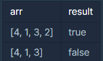

# PCCP 특강
> ## PCCP 실습 2-2 : 순열 검사
> > ### 문제 설명
> >길이가 n인 배열에 1부터 n까지 숫자가 중복 없이 한 번씩 들어 있는지를 확인하려고 합니다.
1부터 n까지 숫자가 중복 없이 한 번씩 들어 있는 경우 true를, 아닌 경우 false를 반환하도록 함수 solution을 완성해주세요.
> >
> > > #### 제한사항:
> > > - 배열의 길이는 10만 이하입니다.
> > > - 배열의 원소는 0 이상 10만 이하인 정수입니다.
>
> > ### 입출력 예
> >
> > 
> >
> > 👉🏻 위와 같습니다.
> >
> > > #### 입출력 예 설명 1
> > > 입출력 예 #1
입력이 [4, 1, 3, 2]가 주어진 경우, 배열의 길이가 4이므로 배열에는 1부터 4까지 숫자가 모두 들어 있어야 합니다. [4, 1, 3, 2]에는 1부터 4까지의 숫자가 모두 들어 있으므로 true를 반환하면 됩니다.
> >
> > > #### 입출력 예 #2
> > > [4, 1, 3]이 주어진 경우, 배열의 길이가 3이므로 배열에는 1부터 3까지 숫자가 모두 들어 있어야 합니다. [4, 1, 3]에는 2가 없고 4가 있으므로 false를 반환하면 됩니다.