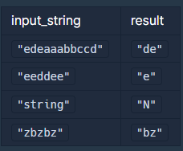

# PCCP 문제집
## PCCP 모의고사(Q1) : 외톨이 알파벳
>알파벳 소문자로만 이루어진 어떤 문자열에서, 2회 이상 나타난 알파벳이 2개 이상의 부분으로 나뉘어 있으면 외톨이 알파벳이라고 정의합니다. 
> 
> 문자열 "edeaaabbccd"를 예시로 들어보면, 
> 
> - a는 2회 이상 나타나지만, 하나의 덩어리로 뭉쳐있으므로 외톨이 알파벳이 아닙니다.
>   - "ede(aaa)bbccd"
> - b, c도 a와 같은 이유로 외톨이 알파벳이 아닙니다. 
> - d는 2회 나타나면서, 2개의 부분으로 나뉘어 있으므로 외톨이 알파벳입니다.
>   - "e(d)eaaabbcc(d)"
> - e도 d와 같은 이유로 외톨이 알파벳입니다.
>
> 문자열 "eeddee"를 예시로 들어보면, 
> - e는 4회 나타나면서, 2개의 부분으로 나뉘어 있으므로 외톨이 알파벳입니다.
>   - "(ee)dd(ee)"
> - d는 2회 나타나지만, 하나의 덩어리로 뭉쳐있으므로 외톨이 알파벳이 아닙니다.
>   - "ee(dd)ee"
> 
> 문자열 input_string이 주어졌을 때, 외톨이 알파벳들을 알파벳순으로 이어 붙인 문자열을 return 하도록 solution 함수를 완성해주세요.
> 만약, 외톨이 알파벳이 없다면 문자열 "N"을 return 합니다.
> >### 제한사항 :
> >
> > - 1 ≤ input_string의 길이 ≤ 2,600 
> > - input_string은 알파벳 소문자로만 구성되어 있습니다
>
> > ### 입출력 예
> >
> >
> >
> > #### 입출력 예 설명
> >
> > ##### 입출력 예 #1 :
> >
> > - 문제 예시와 같습니다.
> > - 외톨이 알파벳인 e, d를 알파벳순으로 이어 붙여 문자열을 만들면 "de"가 됩니다.
> >
> > ##### 입출력 예 #2 :
> >
> > - 문제 예시와 같습니다.
> >
> > ##### 입출력 예 #3 :
> >
> > - 모든 문자들이 한 번씩만 등장하므로 외톨이 알파벳이 없습니다
> >
> > ##### 입출력 예 #4 :
> >
> > - 외톨이 알파벳인 z, b를 알파벳순으로 이어 붙여 문자열을 만들면 "bz"가 됩니다.
