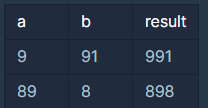

# Day04: 문자열 곱하기
## 프로그래머스 문제(lv0)
> 문자열 my_string과 정수 k가 주어질 때, my_string을 k번 반복한 문자열을 return 하는 solution 함수를 작성해 주세요.
>
>  >제한사항 :
> >
> > - 1 ≤ my_string의 길이 ≤ 100
> > - my_string은 영소문자로만 이루어져 있습니다.
> > - 1 ≤ k ≤ 100
>
> > 입출력 예
> >
> >